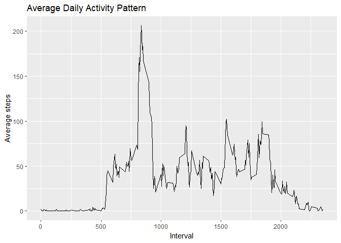

## 1. Loading and Processing the Data
Code that downloads and unzips folder if the required file isn't already in the
working directory. Also loading relevant packages for the data analysis later 
on.


```r
library(dplyr)
```

```
## 
## Attaching package: 'dplyr'
```

```
## The following objects are masked from 'package:stats':
## 
##     filter, lag
```

```
## The following objects are masked from 'package:base':
## 
##     intersect, setdiff, setequal, union
```

```r
library(ggplot2)
library(knitr)
```


```r
filename <- "repdata_data_activity.zip"
if(!file.exists(filename)){
    fileURL <- "https://d396qusza40orc.cloudfront.net/repdata%2Fdata%2Factivity.zip"
    download.file(fileURL, filename, method="curl")
}

if(!file.exists("activity.csv")){
    unzip(filename)
}

# Loading the data
activity <- read.csv("activity.csv")

# Changing date variable to date format
activity$date <- as.Date(activity$date, tryFormats = "%Y-%m-%d")
```


## 2. What is mean total number of steps taken per day?
Calculating mean total steps.

```r
total_steps <- tapply(activity$steps, activity$date, sum, na.rm=TRUE)
```

Plotting mean total steps in a histogram.

```r
qplot(total_steps, main = "Total Steps per Day", 
      xlab = "Total Steps", ylab = "Frequency")
```

```
## `stat_bin()` using `bins = 30`. Pick better value with `binwidth`.
```

<!-- -->

Calculating mean and median number of steps per day.

```r
mean(total_steps, na.rm = TRUE)
```

```
## [1] 9354.23
```

```r
median(total_steps, na.rm = TRUE)
```

```
## [1] 10395
```


## 3. What is the average daily activity pattern?
Calculating average steps for each interval and creating a dataframe with this
new variable to plot as a time series graph.

```r
average_steps <- tapply(activity$steps, activity$interval, mean, na.rm=TRUE)
ts_plot <- data.frame(cbind(unique(activity$interval), average_steps))
colnames(ts_plot) <- c("interval", "avg_steps")
```

Plotting a time series graph using ggplot2.

```r
p <- ggplot(data=ts_plot, aes(interval, avg_steps)) + geom_line() 
p + labs(title="Average Daily Activity Pattern") + ylab("Average steps") + 
    xlab("Interval")
```

<!-- -->

Finding which five-minute interval had the highest average steps.

```r
max(ts_plot$interval)
```

```
## [1] 2355
```


## 4. Imputing missing values
Calculating and reporting the total number of missing values.

```r
sum(is.na(activity))
```

```
## [1] 2304
```

Creating new dataset (activity_imputed) where missing values are replaced by
the average for that corresponding interval.

```r
imputed_steps <- ts_plot$avg_steps[match(activity$interval, ts_plot$interval)]
activity_imputed <- transform(activity, steps = ifelse(is.na(activity$steps), 
    yes = imputed_steps, no = activity$steps))
```

Calculating new average total steps per interval from this new dataset.

```r
total_steps_imputed <- tapply(activity_imputed$steps, 
    activity_imputed$date, sum, na.rm=TRUE)
```

Making a histogram of the total number of steps taken each day with this new
calculation using ggplot2.

```r
qplot(total_steps_imputed, main = "Total Steps per Day", 
      xlab = "Total Steps", ylab = "Frequency")
```

```
## `stat_bin()` using `bins = 30`. Pick better value with `binwidth`.
```

<!-- -->

Calculating the new mean and median

```r
mean(total_steps_imputed)
```

```
## [1] 10766.19
```

```r
median(total_steps_imputed)
```

```
## [1] 10766.19
```
These values differ quite a bit from the values we calculated earlier. In
particular, the mean is much higher in this new calculation. The overall effect
of this has seemingly pushed the median and mean closer together (which makes
sense given we added many more counts of the mean, giving more weight to the
centre).


## 5. Are there differences in activity patterns between weekdays and weekends?
Creating new factor variable to distinguish between weekends and weekdays. Made
after first making a new variable "day" which showed which day of the week each
date was.


```r
activity_imputed$day <- weekdays(activity_imputed$date)
activity_imputed <- mutate(activity_imputed, weekend = 
    ifelse(activity_imputed$day == "Saturday" | 
    activity_imputed$day == "Sunday", "Weekend", "Weekday"))
activity_imputed$weekend <- as.factor(activity_imputed$weekend)
```

Calculating average total steps for each interval for weekends and weekdays

```r
ts_plot_imputed <- aggregate(steps~interval + weekend, activity_imputed, mean)
```

Time series plot of average total steps faceted by weekends and weekdays

```r
q <- ggplot(data=ts_plot_imputed, aes(interval, steps, color=weekend)) + 
    geom_line()
q + facet_grid(rows=vars(weekend)) + 
  labs(title="Average Daily Steps Weekend vs Weekday") +
  ylab("Average steps") + xlab("Interval")
```

<!-- -->
